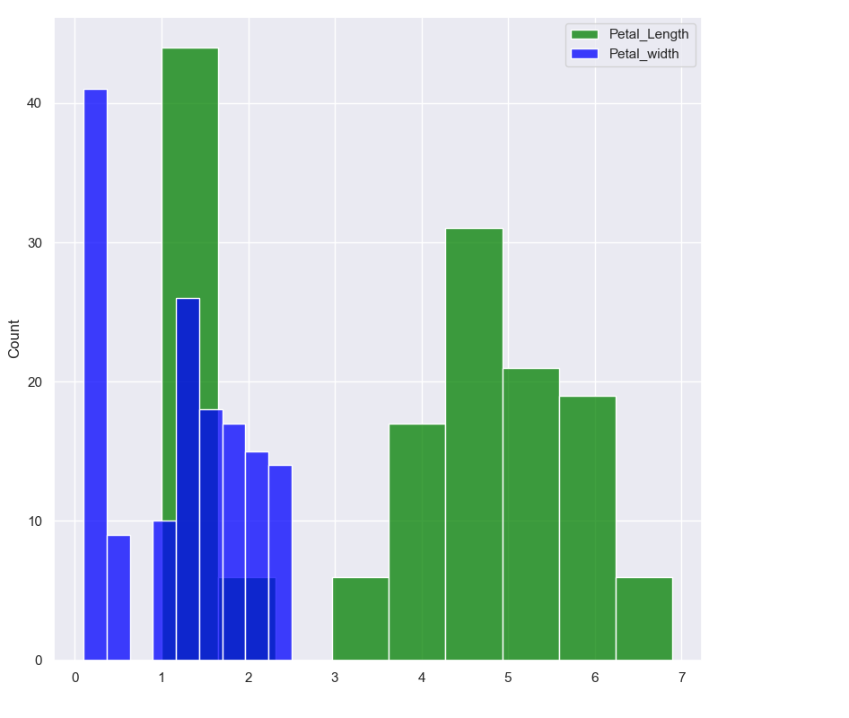
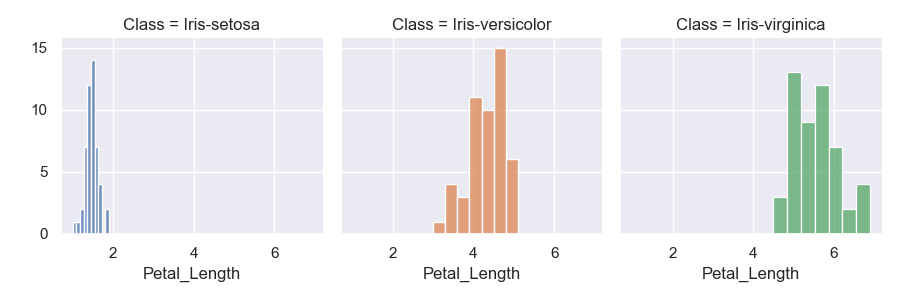
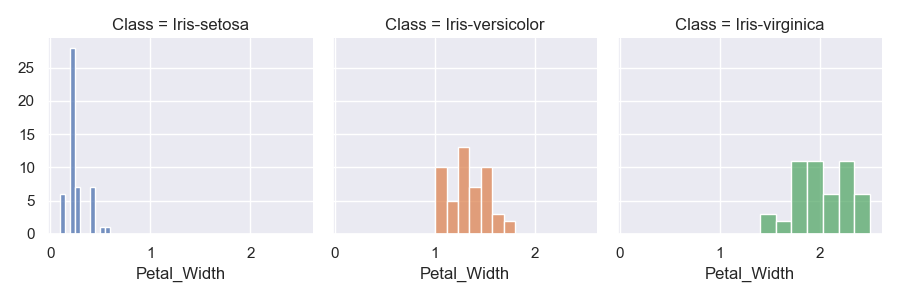
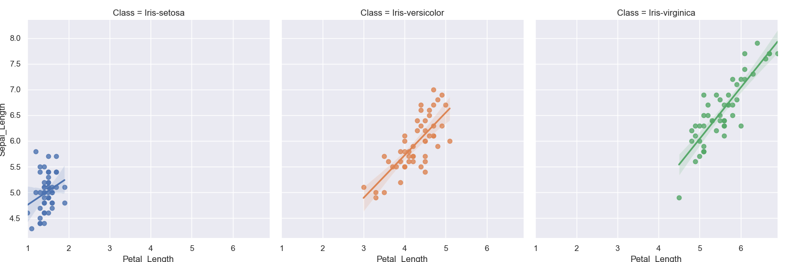
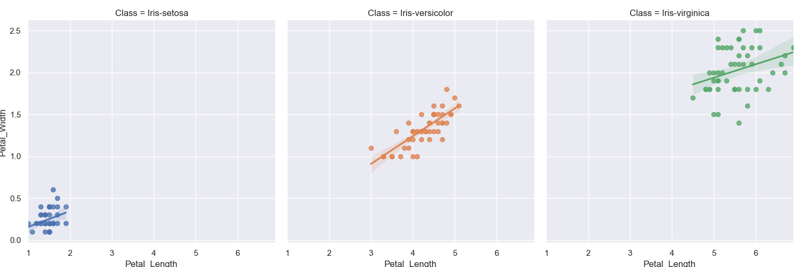
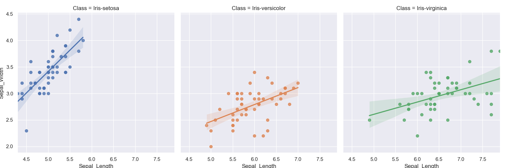
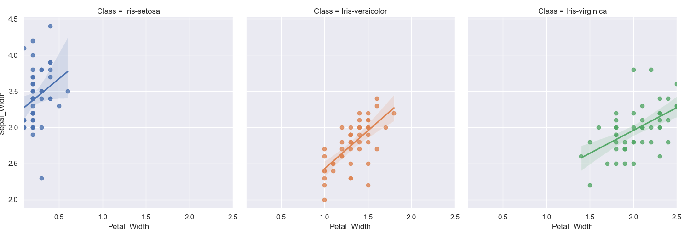

# An Investigation into Fishers Iris Data set utilising Python.  
					
# Introduction 
This project is in fulfillment of the course requirements for GMIT Programming and Scripting 2021, a module of the HDip in Data Analytics.  

# Project Objectives
1. Provide an overview of the Fishers Iris Dataset in the context of its significance to statistical analysis, particularly for statistical classification and machine learning. 
2. Using Python and associated libraries write a program to generate a complete analysis of the data set in both tabular and graphical forms.  
3. Based on the results of the analysis make observations of the significance of the results. 
4. Outpput the results to a project analysis document and make all project related documents available on my GitHub repository.

# The Python Program
## Instructions for Running the Program. 
All of the code for the project is stored in the program 

# Background and Description of the Dataset
The Iris flower dataset is also known as the Fisher’s Iris dataset. As a Fellow of the Royal Society, Sir Ronald Aylmer Fisher was born in 1890 in London, England, and was well-known as a statistician and geneticist. 
In 1936, Fisher published a report titled “The Use of Multiple Measurements in Taxonomic Problems” in the journal Annals of Eugenics. In this article, Fisher developed and evaluated a linear function to differentiate Iris species based on the morphology of their flowers. It was the first time that the sepal and petal measures of the three Iris species, pictured below, appeared publicly.  

The Iris Dataset contains four features (length and width of sepals and petals) of 50 samples of three species of Iris (Iris setosa, Iris virginica and Iris versicolor). Sepals typically act as protection or support for the flower. Petals are often brightly colored and provide clues as to a plant's classification. These measures, 150 in total across the three species, were used to create a linear model to classify the species. The dataset is often used in data mining, classification, and clustering examples and to test algorithms and is perhaps the best-known database to be found in the pattern recognition literature.3 

It is very clear that there is a significant body of information readily available across the internet relating to this dataset and associated analyses. The goal with this project is to carry out an analysis using generally accepted statistical and plotting techniques and analyses using Python and to validate the findings against the already existing results.   

There are several areas that will be outside the scope of this project, including deep statistical analysis and machine learning as I would have insufficient depth of knowledge in these subject areas to make well informed observations. I do note however that this dataset is regarded as the **"hello world"** of machine learning.  

# Project Approach
## General research on the subject.  
As described in the preceding paragraphs there are many sources of information available covering all aspects of analysis of the dataset.  

The dataset itself is widely available, in this case I have used the dataset from https://archive.ics.uci.edu/ml/datasets/iris. This dataset consists of 5 columns and 150 rows across the 3 iris species in a csv format.  

1. sepal length in cm 
2. sepal width in cm 
3. petal length in cm 
4. petal width in cm 
5. class: 
- Iris Setosa 
- Iris Versicolour 
- Iris Virginica 

## Python 
This project utilises 4 Python libraries, namely: 

- **Pandas.** This is a powerful and flexible Python package that allows you to work with labeled and time series data. It also provides statistics methods, enables plotting, and more. One crucial feature of Pandas is its ability to write and read Excel, CSV, and many other types of files. 

- **Numpy.** This is the fundamental package for scientific computing in Python. It is a Python library that provides a multidimensional array object, and an assortment of routines for fast operations on arrays, including mathematical, logical, shape manipulation, sorting, selecting, I/O, discrete Fourier transforms, basic linear algebra, basic statistical operations, random simulation and much more. 

- **Matplotlib.** This is a powerful library that allows for creation of many types of plots and used in conjunction with Pandas allows for data series or dataframes to be plotted in many ways.  

- **Seaborn.** This is a Python data visualization library based on matplotlib. It provides a high-level interface for drawing attractive and informative statistical graphics. 

## Statistical Analysis 

The following are used in the Python program to provide a numerical overview of the data set and are assigned the following variables.  

In each case the analysis is grouped by Iris class and by characteristic across the 4 measurements. All of the tables shown below can be found in the **tables folder** of this project. 

### **Summary Data**
datasummary = (irisdf.describe()).transpose().round(4)
This table provides a summary of the dataset, showing total number of datapoints, overall mean, standard deviation, minimum, maximum, median(50%) as well as the 25% and 75% percentiles. 

_**Table: datasummary.csv**_
|              | count | mean   | std    | min | 25% | 50%  | 75% | max |
| ------------ | ----- | ------ | ------ | --- | --- | ---- | --- | --- |
| Sepal_Length | 150.0 | 5.8433 | 0.8281 | 4.3 | 5.1 | 5.8  | 6.4 | 7.9 |
| Sepal_Width  | 150.0 | 3.054  | 0.4336 | 2.0 | 2.8 | 3.0  | 3.3 | 4.4 |
| Petal_Length | 150.0 | 3.7587 | 1.7644 | 1.0 | 1.6 | 4.35 | 5.1 | 6.9 |
| Petal_Width  | 150.0 | 1.1987 | 0.7632 | 0.1 | 0.3 | 1.3  | 1.8 | 2.5 |

### **Head**
datahead = (irisdf.head(5))
This table displays the individual dataset details for the first 5 rows. 

_**Table: datahead.csv**_
|   | Sepal_Length | Sepal_Width | Petal_Length | Petal_Width | Class       |
| - | ------------ | ----------- | ------------ | ----------- | ----------- |
| 0 | 5.1          | 3.5         | 1.4          | 0.2         | Iris-setosa |
| 1 | 4.9          | 3.0         | 1.4          | 0.2         | Iris-setosa |
| 2 | 4.7          | 3.2         | 1.3          | 0.2         | Iris-setosa |
| 3 | 4.6          | 3.1         | 1.5          | 0.2         | Iris-setosa |
| 4 | 5.0          | 3.6         | 1.4          | 0.2         | Iris-setosa |

### **Tail**
This table displays the last 5 rows of the dataset. 

_**Table: datatail.csv**_
|     | Sepal_Length | Sepal_Width | Petal_Length | Petal_Width | Class          |
| --- | ------------ | ----------- | ------------ | ----------- | -------------- |
| 145 | 6.7          | 3.0         | 5.2          | 2.3         | Iris-virginica |
| 146 | 6.3          | 2.5         | 5.0          | 1.9         | Iris-virginica |
| 147 | 6.5          | 3.0         | 5.2          | 2.0         | Iris-virginica |
| 148 | 6.2          | 3.4         | 5.4          | 2.3         | Iris-virginica |
| 149 | 5.9          | 3.0         | 5.1          | 1.8         | Iris-virginica |

### **Count:**
classcount = irisdf.groupby('Class').count() 
The dataset consists of 50 measurements across the 3 species for each of the Petal Length and Width and Sepal Length and width.  
The output of this can be found in the table classcount.csv and confirms that the correct number of records are included in the dataset. 

_**Table: classcount.csv**_
| Class           | Sepal_Length | Sepal_Width | Petal_Length | Petal_Width |
| --------------- | ------------ | ----------- | ------------ | ----------- |
| Iris-setosa     | 50           | 50          | 50           | 50          |
| Iris-versicolor | 50           | 50          | 50           | 50          |
| Iris-virginica  | 50           | 50          | 50           | 50          |

### **Mean**
classssmean = irisdf.groupby('Class').mean() 
This is the mathematical average of the measurements and can be found in the table classmean.csv.  
On initial inspection it is clear that setosa petal length and width are significantly less than that of the other 2 species.  

_**Table: classmean.csv**_
| Class           | Sepal_Length | Sepal_Width | Petal_Length | Petal_Width |
| --------------- | ------------ | ----------- | ------------ | ----------- |
| Iris-setosa     | 5.006        | 3.418       | 1.464        | 0.244       |
| Iris-versicolor | 5.936        | 2.77        | 4.26         | 1.326       |
| Iris-virginica  | 6.588        | 2.974       | 5.552        | 2.026       |

### **Max**
classmax = irisdf.groupby('Class').max()
This is the maximum measurement for each of the measurement sets and can be found in the table classmax.csv.  
For Setosa the maximum measurement of petal length and width are significantly less than thatof the other 2 species.  

_**Table: classmax.csv**_
| Class           | Sepal_Length | Sepal_Width | Petal_Length | Petal_Width |
| --------------- | ------------ | ----------- | ------------ | ----------- |
| Iris-setosa     | 5.8          | 4.4         | 1.9          | 0.6         |
| Iris-versicolor | 7.0          | 3.4         | 5.1          | 1.8         |
| Iris-virginica  | 7.9          | 3.8         | 6.9          | 2.5         |

### **Min**
classmin = irisdf.groupby('Class').min() 
This is the minimum measurement for each of the measurement sets and can be found in the table classmin.csv.  
Like the analysis above the minimum measurement for setosa across petal length and width are significantly less that of the other 2 species.

_**Table: classmin.csv**_
| Class           | Sepal_Length | Sepal_Width | Petal_Length | Petal_Width |
| --------------- | ------------ | ----------- | ------------ | ----------- |
| Iris-setosa     | 4.3          | 2.3         | 1.0          | 0.1         |
| Iris-versicolor | 4.9          | 2.0         | 3.0          | 1.0         |
| Iris-virginica  | 4.9          | 2.2         | 4.5          | 1.4         |

### **Median**
classmedian = irisdf.groupby('Class').median() 
The measures the value at which 50% of the records are above and 50% below this value. The details can be found in the classmedian.csv table. 	 

_**Table:classmedian.csv**_
| Class           | Sepal_Length | Sepal_Width | Petal_Length | Petal_Width |
| --------------- | ------------ | ----------- | ------------ | ----------- |
| Iris-setosa     | 5.0          | 3.4         | 1.5          | 0.2         |
| Iris-versicolor | 5.9          | 2.8         | 4.35         | 1.3         |
| Iris-virginica  | 6.5          | 3.0         | 5.55         | 2.0         |

### **Standard Deviation**
classstd = irisdf.groupby('Class').std() 
The standard deviation is a measure of the amount of variation or dispersion of a set of values. A low standard deviation indicates that the values tend to be close to the mean (also called the expected value) of the set, while a high standard deviation indicates that the values are spread out over a wider range.  

_**Table: Standard Deviation**_
| Class           | Sepal_Length | Sepal_Width | Petal_Length | Petal_Width |
| --------------- | ------------ | ----------- | ------------ | ----------- |
| Iris-setosa     | 0.3525       | 0.381       | 0.1735       | 0.1072      |
| Iris-versicolor | 0.5162       | 0.3138      | 0.4699       | 0.1978      |
| Iris-virginica  | 0.6359       | 0.3225      | 0.5519       | 0.2747      |

### **Correlation**
classcor= irisdf.corr() 
Correlation measures the extent to which there is a correlation, causal or not, between 2 	variables.  

_**Table: classcorr.csv**_
|              | Sepal_Length | Sepal_Width | Petal_Length | Petal_Width |
| ------------ | ------------ | ----------- | ------------ | ----------- |
| Sepal_Length | 1.0          | -0.1094     | 0.8718       | 0.818       |
| Sepal_Width  | -0.1094      | 1.0         | -0.4205      | -0.3565     |
| Petal_Length | 0.8718       | -0.4205     | 1.0          | 0.9628      |
| Petal_Width  | 0.818        | -0.3565     | 0.9628       | 1.0         |

## Graphical Analysis
This program produces a number of plots to provide a more comprehensive visual overview of the data. 

### Boxplots
A _boxplot_ is highly visual method of displaying the distribution of data based on the five number summary (“minimum”, first quartile (Q1), median, third quartile (Q3), and “maximum”). These have been quantified in the tabels above. It can show the dataset outliers and what their values are. It can also tell you if your data is symmetrical, how tightly your data is grouped, and if and how your data is skewed.

It is clear from the boxplots below that the setosa results are significantly different across the 4 characteristics but that versicolor and virginica are also differentiated. 

### Histogram Plots
The following plots utilise Histograms to display the dataset characteristics. A _histogram_ groups the results into ranges and displays these as vertical (or horizontal) bars. 

### Pairs Plots
The _pairs plot_ below is a method of visualising each characteristic individually and against each other one across the three species. There are 2 pypes of plots used here:
- Distribution Plots: The diagonal plots show the distribution of results for each of the characteristics
- Scatter Plots: These show how the ranges of results for each characteristic compared against each other characteristic. 

### Correlation Plots
The _correlation plots_ show where there may be a relationship between 2 variables, e.g. as x increases y also increases for positive correlation. Where there are clear correlations this data can be used to make predicitons, i.e. given a value of x we can predict a value of y to a degree of accuracy based on how well the values are correlated. 

## References and sources used. 
1. https://pandas.pydata.org/docs/user_guide/index.html
2. https://matplotlib.org/stable/tutorials/index.html
3. https://seaborn.pydata.org/tutorial.html
4. https://numpy.org/doc/stable/user/absolute_beginners.html
5. https://archive.ics.uci.edu/ml/datasets/iris
6. https://dev.to/thalesbruno/subplotting-with-matplotlib-and-seaborn-5ei8
7. https://seaborn.pydata.org/generated/seaborn.lmplot.html
8. https://seaborn.pydata.org/generated/seaborn.lmplot.html
9. https://pandas.pydata.org/docs/reference/api/pandas.DataFrame.to_csv.html
10. https://realpython.com/pandas-python-explore-dataset/
11. https://www.w3schools.com/python/python_ml_mean_median_mode.asp
12. https://www.w3schools.com/python/python_ml_standard_deviation.asp
13. https://www.w3schools.com/python/python_ml_scatterplot.asp
14. https://www.w3schools.com/python/python_ml_linear_regression.asp
15. https://towardsdatascience.com/understanding-boxplots-5e2df7bcbd51#:~:text=Boxplots%20are%20a%20standardized%20way,middle%20value%20of%20the%20dataset.
16. https://statistics.laerd.com/statistical-guides/understanding-histograms.php
17. https://towardsdatascience.com/visualizing-data-with-pair-plots-in-python-f228cf529166
18. https://jakevdp.github.io/PythonDataScienceHandbook/04.14-visualization-with-seaborn.html
19. https://csvtomd.com/#/

